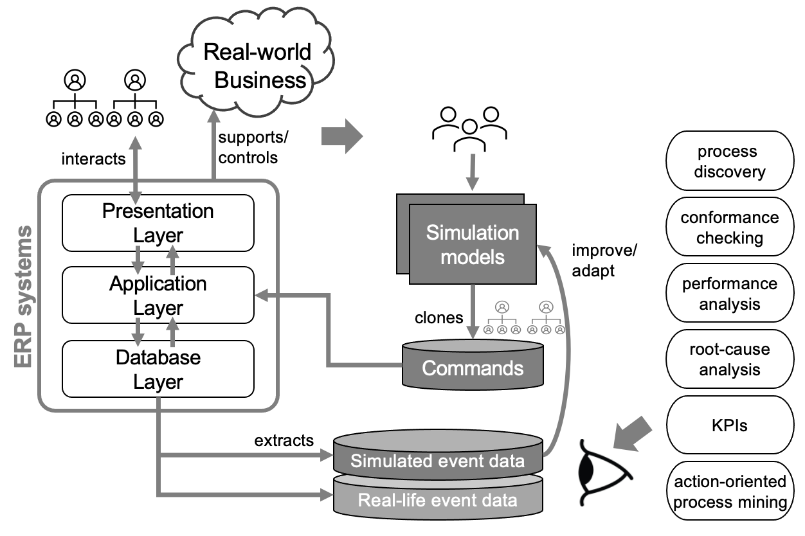

# User Manual

(*Last updated on 11 Mar. 2021)*

## 0. Overview

This ProM plugin implements **a framework for integrating ERP systems into business process simulation.** For the implementation, we use the SAP ERP system with commands generated by CPN Tools.



This figure shows the conceptual overview of ***ERPSimulator*** plug-in. It involves ERP systems in the course of business process simulation. Benefits are multi-folds: 1) we don't have to model the complex design of ERP systems in simulation models, 2) we can acquire reliable simulated event data without omission and commission problems, 3) we can analyze the simulated event data with the same view used to analyze real-life event data (they are extracted from the same database using the same extraction tools).


The figure above describes the overview of the framework. The commands, generated by the simulation engine, are transformed into the executions consumed by ERP systems to update object models (i.e., database).

In the implementation, we use CPN Tools as the simulation engine and SAP ERP ECC 6.0 as the ERP system. In principle, this ProM plugin connects them, while functioning as the transformation engine.

## 1. Input and Output

### Inputs

1. **SAP Credentials**
    - Since we use SAP ERP system as the underlying ERP system, we need the access credential to the SAP system. This will establish a RFC connection to the system used to apply executions to the system.
    - It is stored in XML-based format. Below is an example

    ```xml
    <?xml version="1.0" encoding="UTF-8"?>
    <configurations>
       <credential>
        <string key="host" value="0.0.0.0"/>
        <string key="client" value="800"/>
        <string key="user" value="gyunam"/>
        <string key="passwd" value="secret"/>
        <string key="sysnr" value="0"/>
        <string key="lang" value="en"/>
       </credential>
    </configurations>
    ```

2. **Commands** 
    - Commands are generated by the simulation engine.
    - It is stored in XML-based format. Below is an example:

    ```xml
    <?xml version="1.0" encoding="UTF-8"?>
    <configurations>
    	<commands>
    	    <command>
    	        <activity>place_order</activity>
    	        <resource>Adams</resource>
    	        <timestamp>2021-02-23 10:00:00</timestamp>
    	        <orderId>500004312</orderId>
    	        <customer>1032</customer>
    	        <docType>TA</docType>
    	        <salesOrg>1000</salesOrg>
    	        <materialList>P-101,P-103</materialList>
    	        <quantityList>6,5</quantityList>
    	    </command>
    	    ...
    	</commands>
    </configurations>
    ```

3. **Transaction mapping**
    - It specifies the mapping between SAP transactions and the activities specified in the commands.
    - It is stored in XML-based format. Below is an example:

    ```xml
    <?xml version="1.0" encoding="UTF-8"?>
    <configurations>
    	<transactionMapping>
        <string key="place_order" value="BAPI_SALESORDER_CREATEFROMDAT2"/>
        <string key="create_delivery" value="BAPI_OUTB_DELIVERY_CREATE_SLS"/>
        <string key="pack_items" value="L_TO_CREATE_DN"/>
        <string key="create_invoice" value="BAPI_BILLINGDOC_CREATEMULTIPLE"/>
    	</transactionMapping>
    </configurations>
    ```

4. **Transaction mapping**
    - It specifies the mapping between SAP parameters and information specified in the commands.
    - It is stored in XML-based format. Below is an example:

```xml
<?xml version="1.0" encoding="UTF-8"?>
<configurations>
	<parameterMapping>
    <string key="docType" value="DOC_TYPE"/>
    <string key="customer" value="PARTN_NUMB"/>
    <string key="orderId" value="SALESDOCUMENTIN"/>
    <string key="salesOrg" value="SALES_ORG"/>
    ...
	</parameterMapping>
</configurations>
```

### Output

- **SAP Remote Function Calls (RFCs)**
    - After transforming commands according to the transaction and parameter mappings, the plugin generates SAP RFCs. Those RFCs are directly executed using the RFC connection built according the the credential information.

## 2. How to

### Installation

- (Using ProM nightly build) Download ProM 6 nightly builds and install the package named *ERPSimulator*. Detailed installation instruction available [here](http://promtools.org/doku.php?id=nightly).
- (Using svn) Checkout project from [https://svn.win.tue.nl/repos/prom/Packages/ERPSimulator/](https://svn.win.tue.nl/repos/prom/Packages/ERPSimulator/). Right-click the "ProM with UITopia (ERPSimulator).launch" file and select "RunAs / ProM with UITopia (ERPSimulator)". Detailed steps available [here](https://svn.win.tue.nl/trac/prom/wiki/Contribute).
- (Using GitHub) clone this project and open the project in any IDE. Right-click the "ProM with UITopia (ERPSimulator).launch" file and select "RunAs / ProM with UITopia (ERPSimulator)".

### Hands-on

We provide some example files in `examples/`

1. Import SAP Credential file
2. Import Commands file
3. Import Transaction and Parameter Mapping files
4. If you want to commit the changes in the system, check *commit.*
5. If you want to apply user-defined preprocessing, check *preprocess.*
6. If you want to apply executions one by one, click *execute one.* Otherwise, click *execute all.*


## Remark

- contact [gnpark@pads.rwth-aachen.de](mailto:gnpark@pads.rwth-aachen.de) for more information